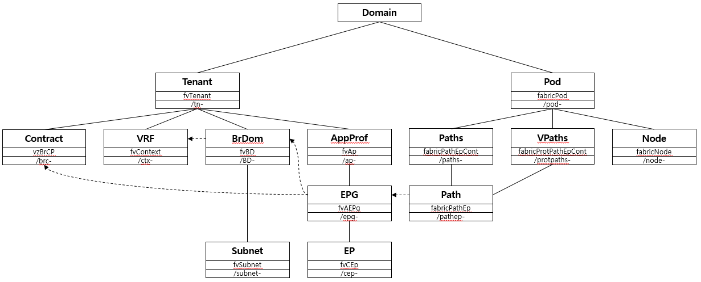

# acidipy
Cisco ACI Python API

**ACI** **D**eveloping **I**nterface for **PY**thon

version : 0.9 Beta

## Support Object

**Prepared Objects**

| ACI Object Name | Acidipy Object Name | Description |
|-----------------|---------------------|-------------|
| fvTenant | TenantObject | Tenant |
| vzFilter | FilterObject | Filter |
| vzBrCP | ContractObject | Contract |
| fvCtx | ContextObject | Virtual Routing and Forwarding (VRF) |
| l3extOut | L3ExternalObject | L3 External |
| fvBD | BridgeDomainObject | Bridge Domain |
| fvAp | AppProfileObject | Appliation Profile |
| vzEntry | FilterEntryObject | Filter Entry |
| vzSubj | SubjectObject | Subject of Contract |
| fvSubnet | SubnetObject | Subnet |
| fvAEPg | EPGObject | Endpoint Group |
| fvCEp | EndpointObject | Endpoint |
| fabricPod | PodObject | Pod |
| fabricNode | NodeObject | ACI Node |
| fabricPathEpCont | PathsObject | Path Endpoint Container |
| fabricProtPathEpCont | VPathsObject | Protected Path Endpoint Container |
| fabricPathEp | PathObject | Path Endpoint |

**And Retrive Anything with Controller Object**

## Install

	$ install
	
Parameters
- -a : install ansible module # Not yet
- -b : install binary tool
- -f : force install
- -r : remove acidipy & packages

## Example Acidipy

	import acidipy
	
	controller = acidipy.Controller('10.72.86.21', 'admin', '1234Qwer', False) # Get controller connection
	
	tenant = controller.Tenant.create(name='example-tenant') # Create tenant
	bd = tenant.BridgeDomain.create(name='example-bd') # Create bridge domain
	ap = tenant.AppProfile.create(name='example-ap') # Create application profile
	epg = ap.EPG.create(name='example-epg') # Create endpoint group
	
	epg.relate2BridgeDomain(bd) # Relate endpoint group to bridge domain
	
	print controller.Tenant.list() # Retrive list of tenant
	print tenant.AppProfile('example-ap').EPG.list() # Retrive list of endpoint group about tenant created
	print ap.EPG('example-epg') # Retrive endpoing group by name
	
	print ap.parent() # Retrive example-ap's parent
	print ap.children() # Retrive example-ap's children
	pirnt ap.detail() # Retrive example-ap's whole attributes
	
	epg.delete() # Delete endpoint group
	ap.delete() # Delete application profile
	bd.delete() # Delete bridge domain
	tenant.delete() # Delete tenant
	
	controller.close() # Close controller connection

## Usages

see Acidipy Library [here](doc/usages_acidipy.md)

see Ansible Module [here](doc/usages_ansible.md)

see Binary Tools [here](doc/usages_bintools.md)
