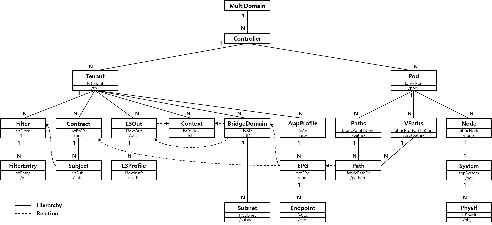

# acidipy
Cisco ACI Python API

**ACI** **D**eveloping **I**nterface for **PY**thon

version : 0.10.0

last change : get attributes method

## Support Object

**Prepared Objects**

| ACI Object Name | Acidipy Object Name | Reserved Code Name | Description |
|-----------------|---------------------|--------------------|-------------|
| fvTenant | TenantObject | Tenant | Tenant |
| fvCtx | ContextObject | Context | Virtual Routing and Forwarding (VRF) |
| fvBD | BridgeDomainObject | BridgeDomain | Bridge Domain |
| fvAp | AppProfileObject | AppProfile | Appliation Profile |
| fvSubnet | SubnetObject | Subnet | Subnet |
| fvAEPg | EPGObject | EPG | Endpoint Group |
| fvCEp | EndpointObject | Endpoint | Endpoint |
| fabricPod | PodObject | Pod | Pod |
| fabricNode | NodeObject | Node | ACI Node |
| fabricPathEpCont | PathsObject | Paths | Path Endpoint Container |
| fabricProtPathEpCont | VPathsObject | VPaths | Protected Path Endpoint Container |
| fabricPathEp | PathObject | Path | Path Endpoint |
| vzFilter | FilterObject | Filter | Filter |
| vzBrCP | ContractObject | Contract | Contract |
| vzEntry | FilterEntryObject | FilterEntry | Filter Entry |
| vzSubj | SubjectObject | Subject | Subject of Contract |
| l3extOut | L3ExternalObject | L3External | L3 External |
| topSystem | SystemObject | System | Node System Details |
| l1PhysIf | PhysIfObject | PhysIf | Physical Interfaces |

**And Retrive Anything with Controller Object**

## Install

	$ python setup.py sdist
	$ python setup.py install

## Example Acidipy

	import acidipy
	
	controller = acidipy.Controller('10.72.86.21', 'admin', '1234Qwer') # Get controller connection
	
	tenant = controller.Tenant.create(name='example-tenant') # Create tenant
	bd = tenant.BridgeDomain.create(name='example-bd') # Create bridge domain
	ap = tenant.AppProfile.create(name='example-ap') # Create application profile
	epg = ap.EPG.create(name='example-epg') # Create endpoint group
	
	epg.relate2BridgeDomain(bd) # Relate endpoint group to bridge domain
	
	print controller.Tenant.list() # Retrive list of tenant
	print tenant.AppProfile('example-ap').EPG.list() # Retrive list of endpoint group about tenant created
	print ap.EPG('example-epg') # Retrive endpoing group by name
	
	print ap.parent() # Retrive example-ap's parent
	print ap.children() # Retrive example-ap's children
	print ap.detail() # Retrive example-ap's whole attributes
	
	epg.delete() # Delete endpoint group
	ap.delete() # Delete application profile
	bd.delete() # Delete bridge domain
	tenant.delete() # Delete tenant
	
	controller.close() # Close controller connection

## Usages

see Acidipy Library [here](doc/usages_acidipy.md)

see Ansible Module [here](doc/usages_ansible.md)

see Binary Tools [here](doc/usages_bintools.md)
