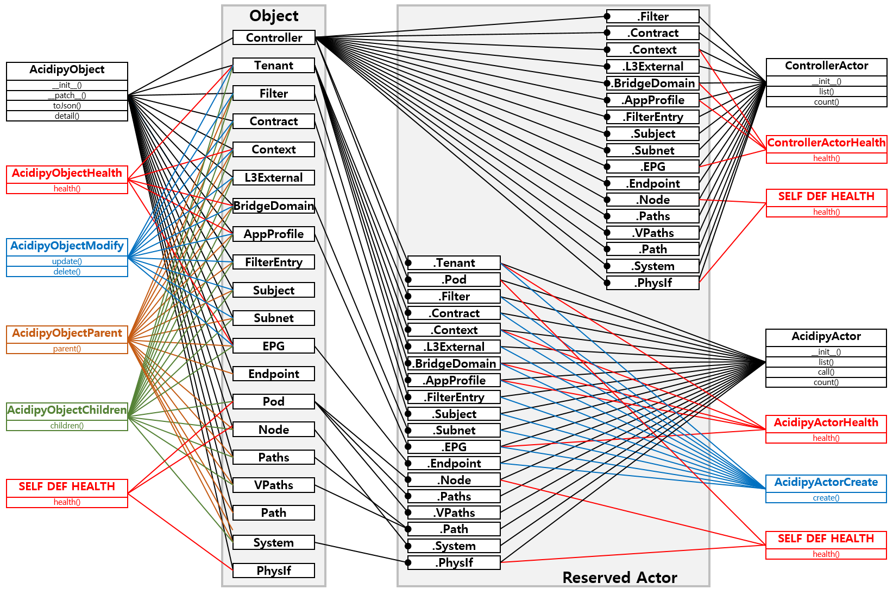

# Acidipy Library

Actor : ACI Class operator with APIC Rest /api/node/class/~
Object : ACI Instance operator of Class with APIC Rest /api/mo/~

## Actor Abstraction

### AcidipyActor

#### Allocation

Grammar : **ACTOR_CLASS()**

#### Retrive list of instance by class name

Grammar : ACTOR_INSTANCE.**list()**

	def list(self, detail=False, sort=None, page=None, **clause)

#### Retrive a instance by target DN

Grammar : ACTOR_INSTANCE**()**

	def __call__(self, detail=False)

#### Retrive counts by class name

Grammar : ACTOR_INSTANCE.**count()**

	def count(self)

### AcidipyActorHealth

#### Retrive list of health data by class name

Grammar : ACTOR_INSTANCE.**health()**

	def health(self)

### AcidipyActorCreate

#### Create a instance by class name

Grammar : ACTOR_INSTANCE.**create()**

	def create(self, **attributes)

### ControllerActor

#### Allocation

### ControllerActorHealth

## Object Abstraction

### AcidipyObject

### AcidipyObjectHealth

### AcidipyObjectModify

### AcidipyObjectParent

### AcidipyObjectChildren

### Acidipy Actor

#### Allocation

**Parameter**

- APIC IP
- User name
- User password

**Return**

Controller Instance

#### Methods

##### toJson()

**Return**

Controller information with Json Formatted

##### detail()

**Return**

Controller information

#### Reserved Object Actor

- Tenant
- Filter
- Contract
- Context
- L3External
- BridgeDomain
- AppProfile
- FilterEntry
- Subject
- Subnet
- EPG
- Endpoint
- Pod
- Node
- Paths
- VPaths
- Path

	
